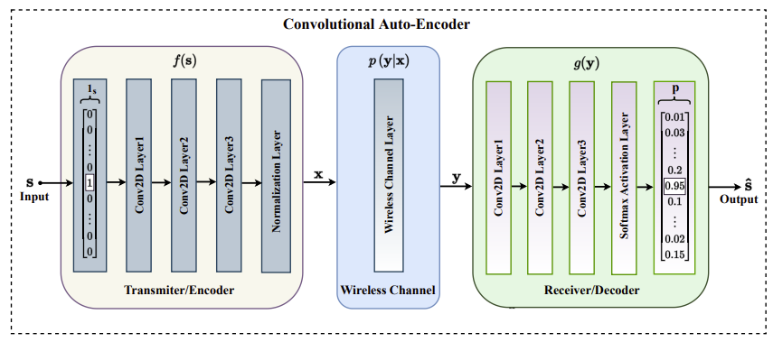

### Auto-Encoder Learning-Based UAV Communications for Livestock Management

#### Index Terms: *Communication Design, Auto-Encoder*

##### Assumption

- one of M possible messages will be sent.
- AE could reduce the dimensionality of the message when delivering, thus save the energy, and minimize the error rate, thus improve the message quality.
- Some constraints will be used on the compressed message based on the energy consumption.

##### Basic Idea

This paper describes a simple AE, which is a unsupervised model to extract the features of the message. Here x could be considered as the compressed features of the original message, and x will be transmitted from UAV to the base station or server, and be recovered by a decoder to classify the message type. From the paper, the author thinks the features extracted from the message may be more robust when delivered in the channel and consume less energy.