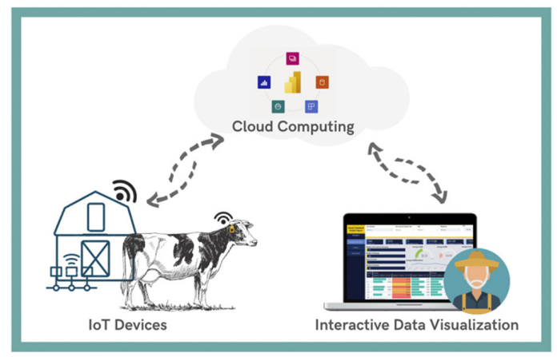
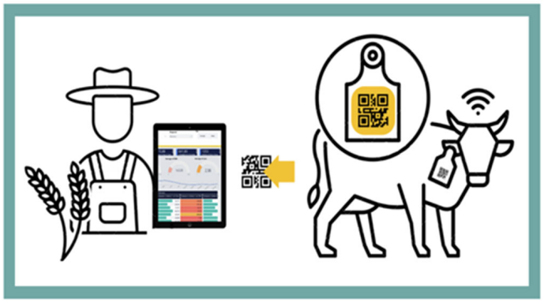
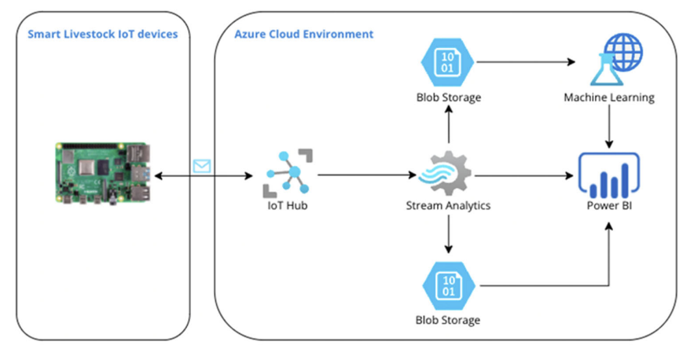

### Cloud Data-Driven Intelligent Monitoring System for Interactive Smart Farming

#### Index Terms: *Cloud Server, Visualization & Interaction*

##### Assumption

- The farmer should have an interactive interface in terms of remote and on-premises monitoring.
- UAV is not introduced in this paper.
- As the standard assumption, IoT devices are deployed to collect data from livestock, the paper focuses on designing the cloud server components and the interactive parts.

##### Basic Idea

In summary, the paper designs the interactive smart farm from remote and on-premises monitoring. For remote interaction, the data collected from the IoT devices like collars will be transmitted to the cloud server. And the cloud server interface could be access by computers, mobile apps, or tablets through Internet. The data will be presented historically or dynamically. For on-premises monitoring, the farmer could scan the QR code from the tag on the ear of the livestock to check the personalized details of the livestock like the identification and health condition. 

Specifically for the cloud server

IoT Hub will collect the data from IoT devices, which can be considered as the interface of the server to communicate with the external devices. 

Blob Storage as described by its name, will store blob files like images, videos or audios. These large data will be used for analysis or aggregated for visualization.

Stream Analytics: Used for real-time data analytics. The stream data will be input and processed.

Power BI: A interface to visualize the data or prediction given by ML.