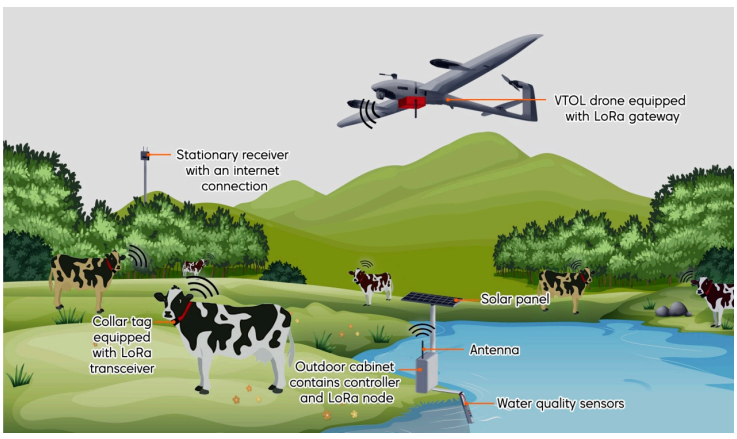
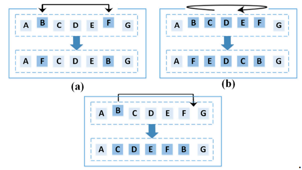

### LoRa Communications as an Enabler for Internet of Drones towards Large-Scale Livestock Monitoring in Rural Farms

#### Index Terms: *Communication / Routing Tech, Path Planning, Hardware Design*

##### Assumption:

- The UAVs will not only collect data from livestock, they will also try to collect the data of the quality of the water source by establishing a water inspection sensor since water is essential for livestock.
- LoRa is integrated into UAV so that it could detect the sensors from a longer range. This is detailed in a hardware aspect.
- Formulate the path finding of UAVs into a traveling salesman problem (TSP). That is, we assume a UAV could start from one sensor, go through every other sensors and back to the start point without visiting certain sensor more than once. Things may change if we use multiple UAVs to solve this.

##### Basic Idea

This paper designs a relatively complete system for the farm from the perspective of both the hardware design and algorithm design. For example, the sensors used in water inspection and livestock are described for its hardware components and some requirements. The network (LoRa) is designed by specifying its parameters and requirements. Based on the assumption that the author formulates the path planning problem into TSP, they propose to use enhanced PSO algorithm. PSO (particle  swarm optimization) formulate the position of the particle as a sequence of the nodes, and the velocity of the position as the tuple of two nodes which means swap the order of two nodes. Based on PSO, EPSO assume the mutation will happen in every iteration, including swapping, reversing and inserting. This is to avoid that the solution is trapped to local minimum.