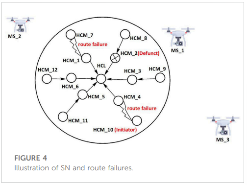
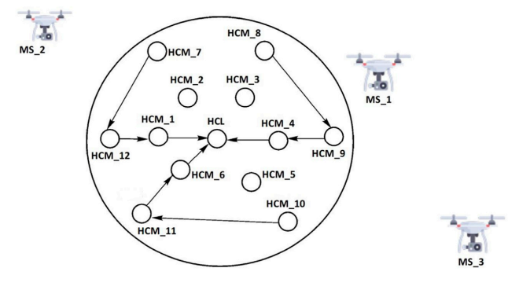

### RUBER: Recoverable UAV-based energy-efficient reconfigurable routing scheme for smart wireless livestock sensor network

#### Index Terms: *Communication / Routing Scheme*

##### Assumption

- Almost same as the previous one (UBER).
- Now SNs should be smart enough to deal with some failure cases when routing (i.e. recovery).

##### Basic Idea

Based on the assumption and method proposed in UBER, the herd is divided into several clusters and every cluster should elect a cluster lead according to the signal strength calculated (e.g. CCx) and the amount of energy left (e.g. HCLpr). Here the author further explores some cases where the HCM may fail to transmit the data.

route failure: when a node consecutively transmits the data to another one but does not receive the response.

SN failure (Initiator): The node has no longer the ability to receive the response.

SN failure (Transmitter): The node has no longer the ability to send the package.

Traffic-only: The node can only receive and forward the package without sensing modules.

Defunct: The node can not work at all.

A backup node will be used to replace the abnormal node as described in above cases.