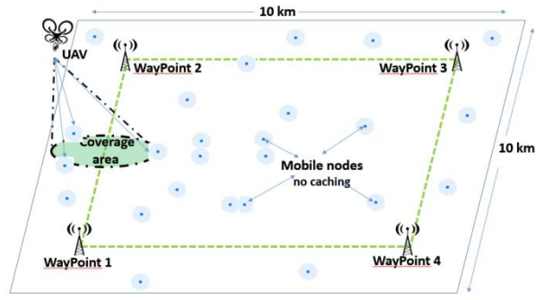
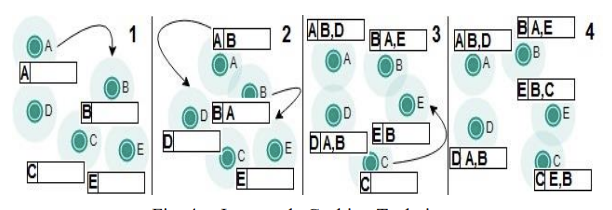

### UAV Aided Data Collection for Wildlife Monitoring using Cache-enabled Mobile Ad-hoc Wireless Sensor Nodes

#### Index Terms: *Routing / Communication Scheme, Caching*

##### Assumption

- Levy Walk Model: Move until find a resource (e.g. water), and randomly walk around the resource.

- The nodes have the ability to communicate with each other (e.g. exchange data)
- UAV only follows the fixed path towards the established waypoints.
- Two versions of transmission. WP: UAVs only collect data from the fixed waypoints (Nodes will exchange data with waypoints); UAV: UAVs will collect data from encountered nodes during the trip rather than collecting from the waypoints.

##### Basic Idea

Based on the assumption, now we assume the sensors could exchange data with each other when encountered. That is, for example, two sensors A and B with data da and db respectively. If A and B exchange data with each other, A and B will contain both da and db in the cache. That is, two nodes will synchronize the data to make it consistency. When this sort of process is done and the UAV tries to collect the data from certain node, we can think of that the UAV not only exchange data with this node, but indirectly contact other nodes, which improves the communication efficiency and save energy.