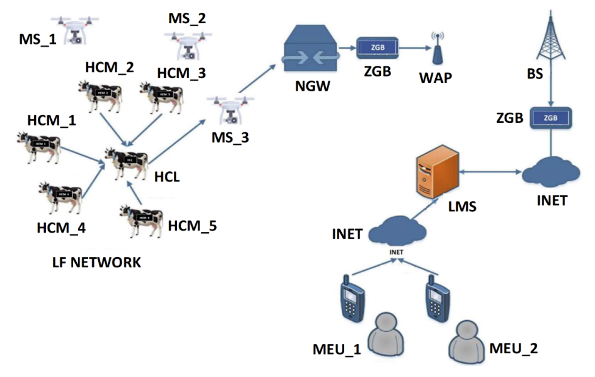

### UBER: UAV‐Based Energy‐Efficient Reconfigurable Routing Scheme for Smart Wireless Livestock Sensor Network

#### Index: *Communication / Routing Scheme*

##### Assumptions

- wearable, portable, identical sensor nodes (e.g. collar)
- Every node or UAV consumes energy. UAV may contain more energy storage, capacities and radio abilities.
- UAV can move in a 3d-space with no axis rotation and a stationary velocity.
- UAV has smart decision-making intelligence and is controllable.

##### Basic Idea

Cluster Based Routing: The herd is divided into several clusters depending on certain measure (e.g. similarity, score function). Specifically, here HCM can be interpreted as the cluster member, HCL can be interpreted as the cluster lead. Every cluster member will relay their own information such as body temperature, humidity to the lead of their own clusters. Then cluster leads will aggregate these data and relay the data to the nearest UAV. Finally, UAV will transfer the data to the cloud server for further analysis.

##### Strategy

1. Evaluate the signal strength of each node
2. Calculate the probability / score of each node. Higher score will indicate a higher probability to be elected as lead.
3. Each node will select the lead with the least signal strength in its neighbourhood. ??
4. next round until maximum round is reached
5. Gather data when stationary

